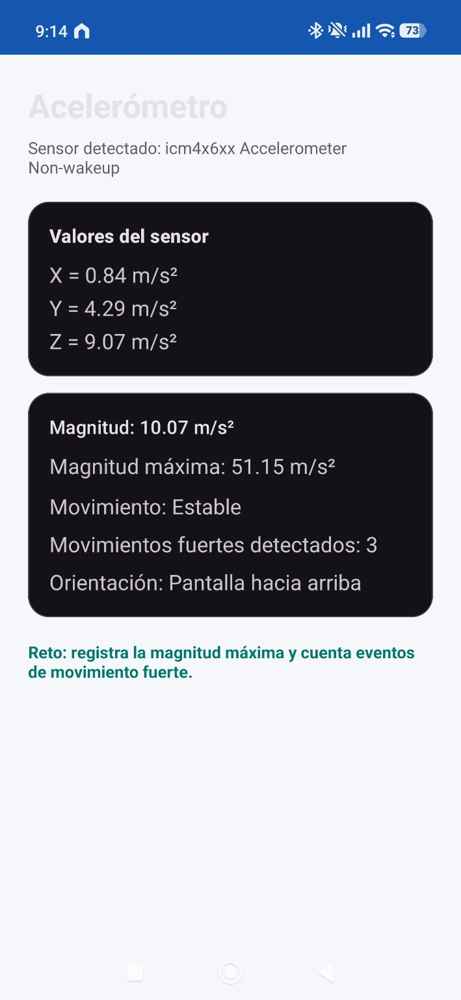
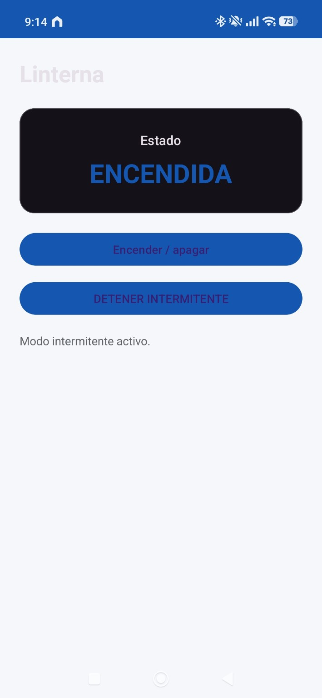
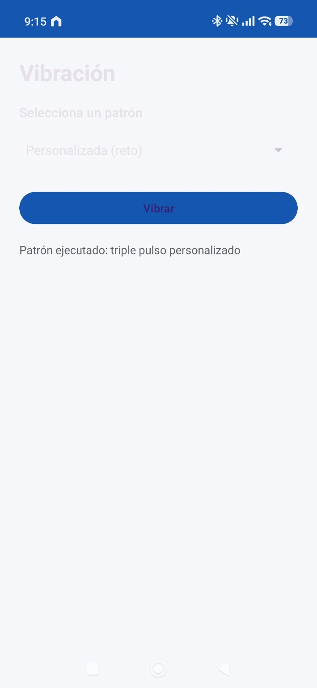
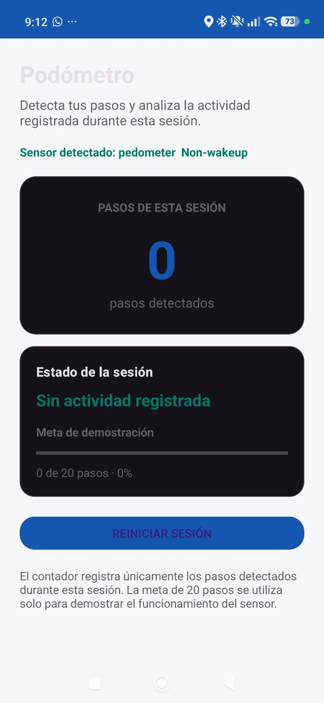
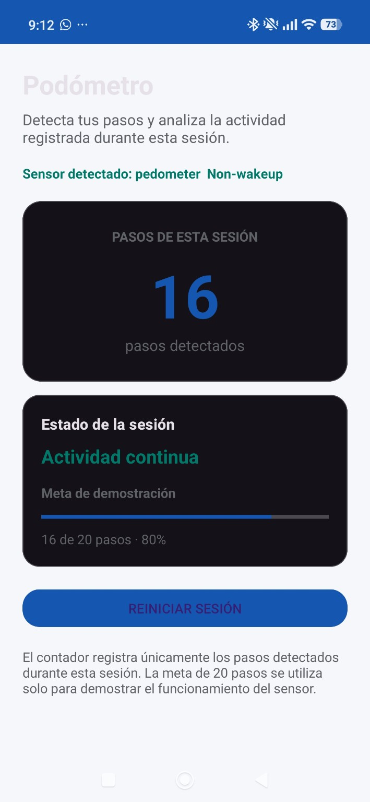
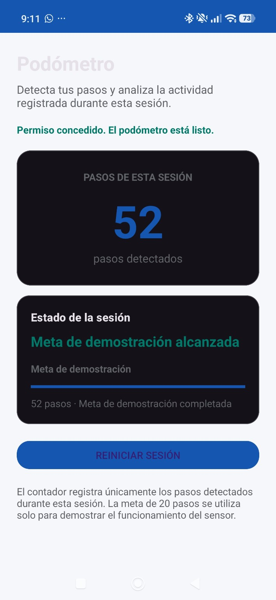

# PhoneLab Android

Aplicación Android desarrollada en Kotlin para trabajar con sensores y periféricos del teléfono.

El proyecto parte de una plantilla base y se completaron los retos solicitados para:

- Acelerómetro
- Linterna
- Vibración
- Sensor/periférico adicional

Además, se agregó un módulo de podómetro para detectar pasos y mostrar una interpretación sencilla de la actividad registrada.

---

## Funcionalidades

### Acelerómetro

El módulo permite:

- Ver los valores X, Y y Z.
- Mostrar la magnitud actual.
- Registrar la magnitud máxima alcanzada.
- Detectar movimientos fuertes.
- Contar movimientos fuertes sin repetir varias veces el mismo evento.
- Mostrar la orientación aproximada del teléfono.

### Evidencia

<p align="center">
  
</p>

---

## Linterna

El módulo permite:

- Encender y apagar la linterna.
- Activar un modo intermitente.
- Detener el modo intermitente.
- Apagar la linterna automáticamente al salir de la pantalla.

### Evidencia

<p align="center">
  
</p>

---

## Vibración

El módulo incluye diferentes patrones de vibración:

- Vibración corta.
- Vibración larga.
- Vibración doble.
- Patrón personalizado.

Para el reto se agregó un patrón de **triple pulso personalizado**.

### Evidencia

<p align="center">
  
</p>

---

## Podómetro

Como sensor adicional se implementó un podómetro.

El módulo permite:

- Detectar pasos realizados por el usuario.
- Mostrar los pasos de la sesión actual.
- Reiniciar el contador.
- Mostrar el avance hacia una meta de demostración.
- Interpretar la actividad registrada.

Los estados utilizados son:

- Sin actividad registrada.
- Primeros pasos de la sesión.
- Caminata corta detectada.
- Actividad continua.
- Meta de demostración alcanzada.

La meta de 20 pasos se utiliza únicamente para demostrar el funcionamiento del sensor.

### Sesión reiniciada

<p align="center">
  
</p>

### Actividad detectada

<p align="center">
  
</p>

### Meta alcanzada

<p align="center">
  
</p>

---

## Retos completados

| Reto | Descripción | Estado |
|---|---|---|
| A1 | Registrar la magnitud máxima del acelerómetro | ✅ |
| A2 | Contar movimientos fuertes sin duplicarlos | ✅ |
| L1 | Implementar un modo intermitente para la linterna | ✅ |
| V1 | Crear un patrón personalizado de vibración | ✅ |
| S1 | Implementar un sensor o periférico adicional | ✅ |

---

## Tecnologías utilizadas

- Kotlin
- XML
- Android Studio
- Android Sensor Framework
- CameraManager
- VibrationEffect
- Git
- GitHub

---

## Permisos utilizados

La aplicación utiliza permisos para:

- Vibración.
- Reconocimiento de actividad física para el podómetro.

---

## Cómo ejecutar el proyecto

1. Clonar el repositorio:

```bash
git clone https://github.com/GonzaloTT/PhoneLab-Android.git